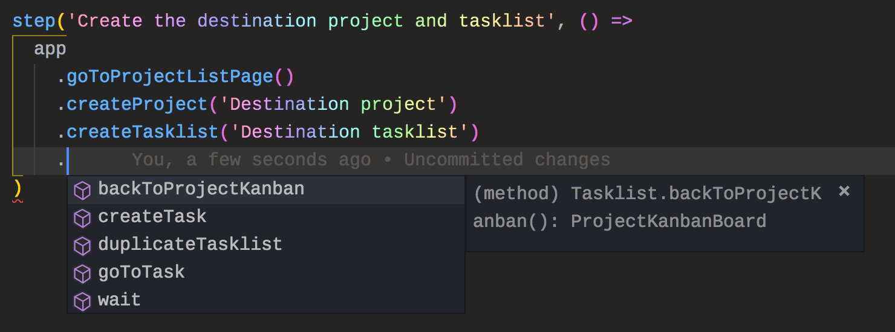

# Tips for writing tests

## Use the Page Object pattern

You can create classes to implement the Page Object pattern. At Taskworld, we
use this pattern to help keep our test code more concise. We also get
IntelliSense while we write our test code!



You can read more about this pattern in
[_Use page object pattern for more fluent and maintainable tests_](./writing-tests.md#use-page-object-pattern-for-more-fluent-and-maintainable-tests)
section.

## Retrying

Some steps may take more than 1 try to be able to be successfully carried out.
You can create a `retry` function that will run your function for up to 3 times.

```js
async function retry(f, n = 3) {
  let error
  for (let i = 0; i < n; i++) {
    try {
      return await f()
    } catch (e) {
      error = e
    }
  }
  throw error
}
```

And use it like this:

```js
action('Action', async state => {
  await retry(async () => {
    // ... your code ...
  })
})
```

## Recovery mechanism

Sometimes your tests may be interrupted by **“ENTER YOUR EMAIL TO SUBSCRIBE TO
OUR NEWSLETTER”** or **“WE HAVE UPDATED OUR PRIVACY POLICY”** or similar modal
dialogs.

You may create an “attemptRecovery” function that will attempt to get you out of
the situation.

```js
async function attemptRecovery(state, context) {
  // dismiss GDPR modal, if exists
  // dismiss newsletter subscribe modal, if exists
  // dismiss Intercom modal, if exists
  // ...
}
```

Then you can use it in conjection with `retry()` for more resilience.

```js
action('Action', async (state, context) => {
  await retry(async () => {
    await attemptRecovery(state, context)
    // ... your code ...
  })
})
```
