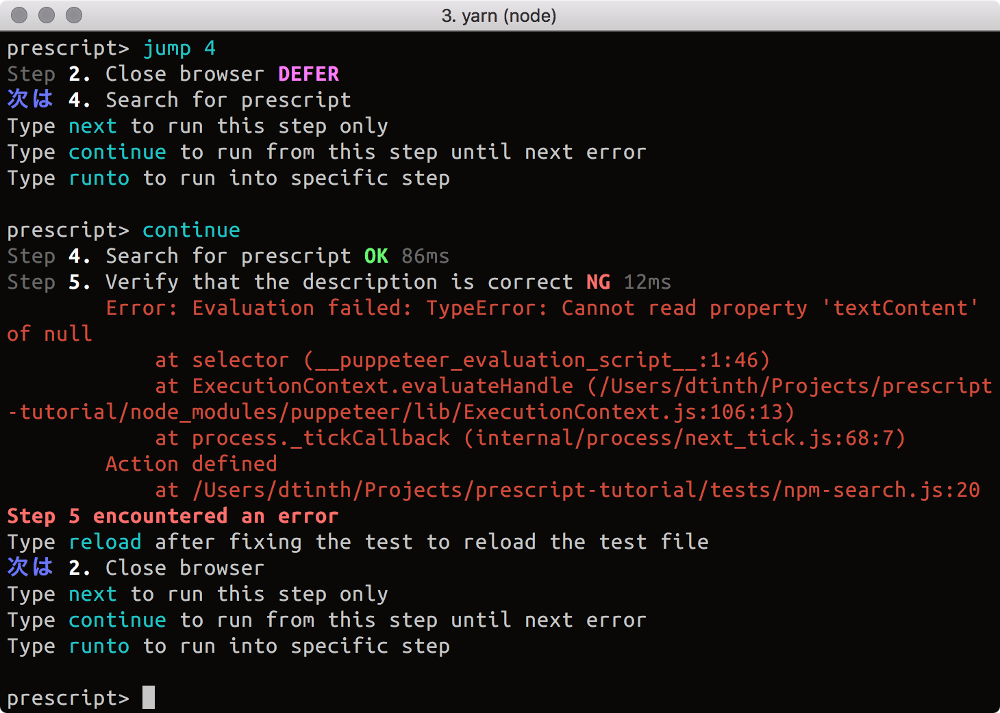
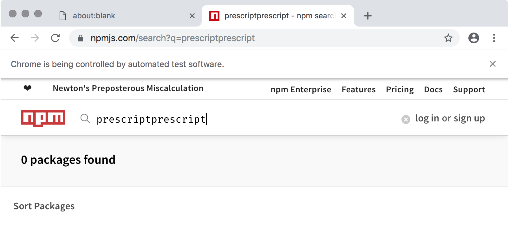
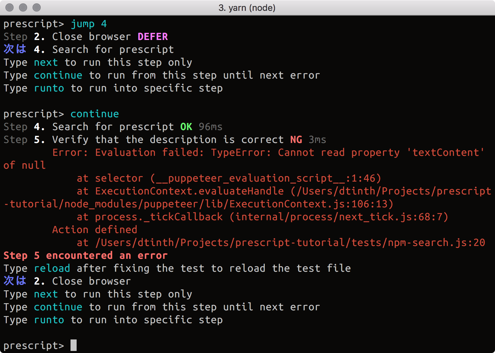
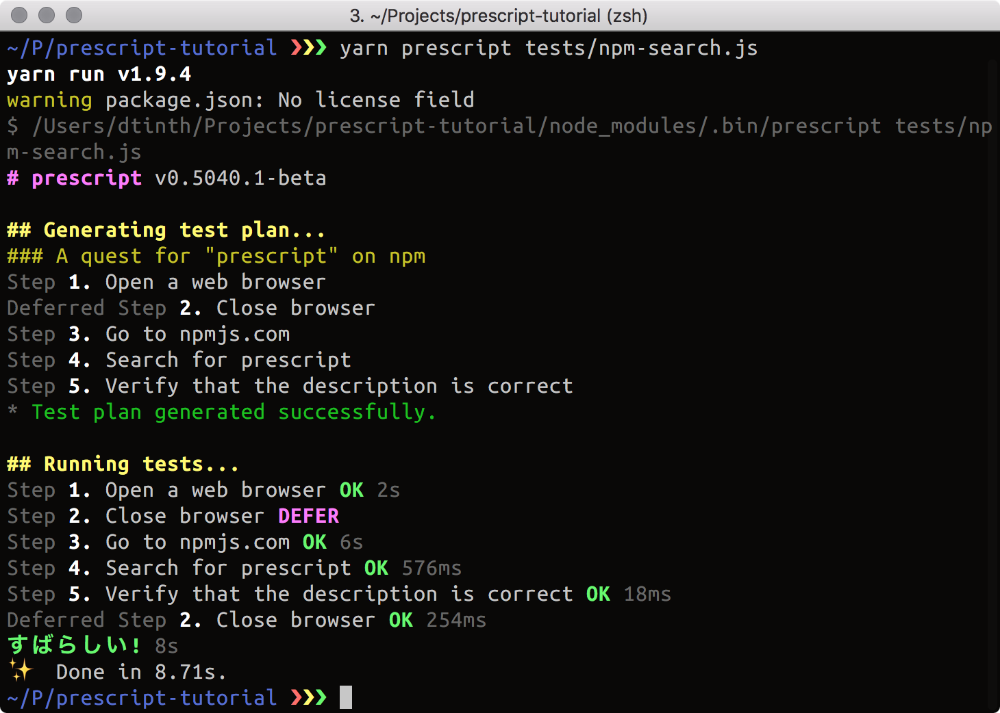
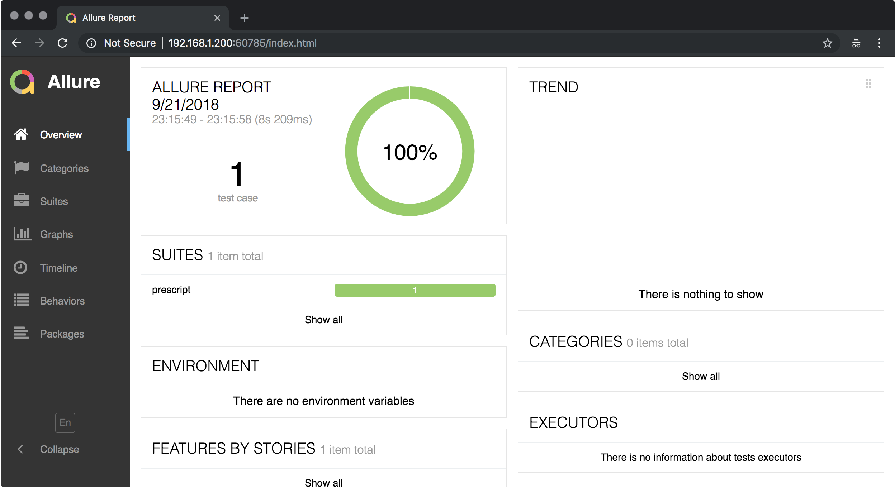
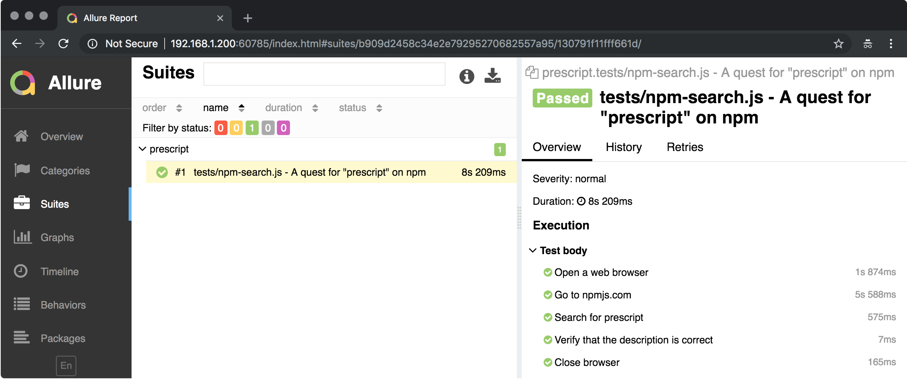

# A quick prescript primer (Tutorial)

Ready for a **prescript**ed experience? You’ll need:

* [Node.js](https://nodejs.org/en/) (at least version 8)
* [Yarn](https://yarnpkg.com/en/) (make sure you have the latest version!)

I assume you know how to use Node.js and Yarn.

In this tutorial, we’ll learn:

* How to create a test file.
* How to use the **prescript interactive shell** to debug and fix a test file.
* How to run the test and generate a report.

We’re going to write a simple test using **prescript** and
[Puppeteer](https://github.com/googlechrome/puppeteer/). It will go to
`npmjs.com`, search for `prescript`, and verify that prescript is actually on
npm.

## Test project setup

* Let’s start by creating a new project:

  ```bash
  mkdir prescript-tutorial
  cd prescript-tutorial
  ```

* Install `prescript` and `puppeteer`:

  ```bash
  yarn add --dev prescript puppeteer
  ```

* Create a folder to store all our tests:

  ```bash
  mkdir tests
  ```

Now, our directory structure should look like this:

```
prescript-tutorial
├── tests/
├── package.json
└── yarn.lock
```

## Create the test file

* Create a file called `tests/npm-search.js` and paste in:

  ```js
  const puppeteer = require('puppeteer')
  const { test, action, defer } = require('prescript')
  const assert = require('assert')

  test('A quest for "prescript" on npm', () => {
    action('Open a web browser', async state => {
      state.browser = await puppeteer.launch({ headless: false })
      state.page = await state.browser.newPage()
    })
    defer('Close browser', async state => {
      state.browser.close()
    })
    action('Go to npmjs.com', async state => {
      await state.page.goto('https://npmjs.com')
    })
    action('Search for prescript', async state => {
      await state.page.type('[name="q"]', 'prescript')
    })
    action('Verify that the description is correct', async state => {
      const description = await getText(
        state.page,
        '[class^="package-list-item__description"]'
      )
      assert.equal(description, 'an end-to-end test runner that sparks joy')
    })
  })

  function getText(page, selector) {
    return page.evaluate(
      selector => document.querySelector(selector).textContent,
      selector
    )
  }
  ```

- The `test()` function declares a **test**. A test can contain multiple
  **steps**.
- The `action()` function declares an **action step**, which represents a test
  action to be executed.
- The `defer()` function declares a **deferred step**, which represents an
  action to be performed at the end of the test (similar to
  [Go’s defer statement](https://tour.golang.org/flowcontrol/12)), and is useful
  for cleaning up and closing resources.

::: tip THE `state` VARIABLE

You may notice there’s a variable called `state`. You must put everything that’s
shared between steps in this variable.

**Do not create variables to hold the state of your tests.** You may ask, “why
can’t we just use local variables, i.e. putting `let browser` at the top of the
file?” Well, you’ll see why soon… ;)

:::

## Run the test in development mode

Now we have the test, let’s run it!

* Run the test in **development mode** using `yarn prescript -d <test-file>`:

  ```bash
  yarn prescript -d tests/npm-search.js
  ```

This will drop you into a **prescript interactive shell:**


* Type in **`continue`** and press Enter.

This will run the test to its completion (or until it hits an error).

Let’s see how it goes…


Oops, there’s an error!

From the terminal output, we see that **the test failed at step 5** (‘Verify
that the description is correct’)… This is one benefit of breaking your test
into discrete steps — the tool can tell you exactly which step failed.

It’s time to debug!

## Debugging the test

Now, since we are in **interactive development mode**, the test is **paused**
here to let you inspect what’s going on. (In many other tools, the browser would
have closed immediately.)

Now we can take a look at the browser:


Hm… 🤔 what’s going on here???…………Oh! 😲 There it is! 💡

We found that in **step 4 (‘Search for prescript’), we typed the search text but
didn’t press Enter.** That’s why we stay at the same page...

<!-- prettier-ignore-start -->
```js {2}
  action('Search for prescript', async state => {
    await state.page.type('[name="q"]', 'prescript')
  })
```
<!-- prettier-ignore-end -->

So, we can say that **the fault in step 4 caused the failure in step 5.**

::: tip FAULT vs FAILURE

**prescript** tells you which step caused the test to fail. But the **failure**
may be caused by a **fault** in a prior step.

:::

## Fixing the test

Let’s go ahead and fix it…

<!-- prettier-ignore-start -->

* Update the test so that we press Enter key after typing in “prescript”:

  ```js {3}
    action('Search for prescript', async state => {
      await state.page.type('[name="q"]', 'prescript')
      await state.page.keyboard.press('Enter')
    })
  ```

* Don’t forget to save the file.

<!-- prettier-ignore-end -->

## Hot-reloading the test

Now we’re going to hot-reload our test file.

* Come back to **prescript interactive shell**.

* Type in **`reload`** (or `r`) and press Enter.

The test plan will be reloaded, but all your test state will remain intact.


::: tip NOTE

That’s why we need to use prescript-provided `state` object — its contents are
preserved across reloads! Had we used local variables (i.e. using
`let browser, page` instead of `state.browser` and `state.page`), our
newly-loaded test code wouldn’t be able to access the `browser` and `page`
created in the previously-loaded test code, because it’s — well — local to it.
That’s how hot-reloading is made possible in prescript.

:::

## Resuming the test

When you **`reload`** your test, prescript will put you before the failed step.

But as aforementioned, the fault in **step 4** caused the failure in **step 5**.
That means to recover, we must go back to **step 4** and continue from there.

* Jump to step 4 by typing **`jump 4`** (or `j 4`) and press Enter.

* Continue running the test by typing **`continue`** (or `c`) and press Enter.

::: tip NOTE

That’s why you need to break down your test into discrete steps — this allows
prescript to take control of the way your test code is executed, thus letting
you jump around and resume execution in the middle of your test.

:::

Let’s see how it goes…



Waaaa—!

It failed again!

Let’s look at the browser to see what happened...



This time, the search box contains the text ‘prescriptprescript’. Since we
**retried** step 4, it got executed twice. That means the word ‘prescript’ got
typed into the search box twice!

::: tip LESSON

When reloading or jumping, make sure to roll the state back before continuing!

:::

## Rolling the state back

Ok, let’s try again.

* Jump back to step 4 by typing **`jump 4`** (or `j 4`) and press Enter.

* **In the browser, manually delete the text in the search box.** Also click the
  Back button so that we are back to npm’s homepage. **This effectively brings
  us to the known state before step 4 is first executed.**

* Continue running the test by typing **`continue`** (or `c`) and press Enter.



Ouch… It failed again, at **step 5** (‘Verify that the description is correct’)!

But this time, it seems that the browser is showing the correct result.

This is because **step 4 finished immediately after we press Enter.** It didn’t
wait for the search results to load or anything; it just hit Enter and moved on
to **step 5** right away. So, **step 5** tried to verify the search result
immediately, when it’s not available yet. Of course, this would fail the test.

## Fault containment

As you can see, a **fault** in one step can cause a **failure** in subsequent
steps. This can lead to tests that are hard to debug. To write tests that can be
easily debugged, it’s important to follow the **fault containment principle…**

::: tip FAULT CONTAINMENT PRINCIPLE

Make sure each step verifies the outcome of its own action.

For example,

* Step 1 (‘Go to npmjs.com’) should wait for the web page to load, and verify
  that `npmjs.com`’s home page is indeed displayed (instead of e.g. 502 pages).
* Step 2 (‘Search for prescript’) should wait for the search results to load,
  and verify that the search results are available before moving on.

:::

<!-- prettier-ignore-start -->

* Update the test so that each step waits and checks for the outcome of its own
  actions (Don’t forget to save the file!):

  ```js {3,8}
    action('Go to npmjs.com', async state => {
      await state.page.goto('https://npmjs.com')
      await state.page.waitForSelector('#app main')
    })
    action('Search for prescript', async state => {
      await state.page.type('[name="q"]', 'prescript')
      await state.page.keyboard.press('Enter')
      await state.page.waitForSelector('[class^="search__packageList"]')
    })
  ```

## Seeing the test pass

Hopefully, we’ve fixed everything now.

* In **prescript interactive shell**, **`reload`**, **`jump 4`**, and **`continue`**.

<!-- prettier-ignore-end -->

Now, our test should pass ;)


* Exit prescript by typing **`exit`** and press Enter.

Now you can see how having an **interactive development mode** can help you
debug a failed test with tighter feedback loop.

## Running the test in non-interactive mode

Having an **interactive development mode** at hand is great, but we also want to
run our tests as part of a continuous integration build process. That’s where we
should run the test in non-interactive mode.

* Run the test in **non-interactive mode** using `yarn prescript <test-file>`:

  ```bash
  yarn prescript tests/npm-search.js
  ```

This will run the test to its completion, or exits with an error code if the
test failed. The prescript interactive shell is not available in this mode.



## Generating Allure test reports

As introduced in the previous page, prescript can generate a beautiful test
report using Allure.

* Install the **Allure** command-line tool by following the
  [installation steps in its docs](https://docs.qameta.io/allure/#_installing_a_commandline).

* Set the environment variable `ALLURE_TEST_RESULTS` for the current shell:

  ```bash
  # Linux, macOS
  export ALLURE_RESULTS_DIR=allure-results

  # Windows
  SET ALLURE_RESULTS_DIR=allure-results
  ```

* Run the test in **non-interactive mode**:

  ```bash
  yarn prescript tests/npm-search.js
  ```

You should see a directory called **allure-results** created. Inside it, you
should see XML files.

::: tip NOTE

If you use Git, don’t forget to add `allure-results` to your `.gitignore`.

:::

### View the test report

As you can see, **prescript** generates XML files to be used by Allure to
generate a test report.

* To view the test report:

  ```bash
  allure serve allure-results
  ```





Nice.

### Generate the test report

The `allure serve` command lets you view the report in the browser. But you may
want to generate the test report and upload them for others to see.

* To generate the test report:

  ```bash
  allure generate test-results
  ```

A directory `allure-report` should pop up in your project directory. You can
then publish your generated `allure-report` and share with your colleague.

::: tip NOTE

If you use Git, don’t forget to add `allure-report` to your `.gitignore`.

:::

## Conclusion

* We learned how to write test in prescript using the `test`, `action`, and
  `defer` APIs.
* We learned how to use the **prescript interactive shell** to debug a test.
* We learned how to run tests in **interactive development mode** and
  **non-interactive mode**.
* We learned how to generate an **test report** using Allure.

The next section will dive into more details about writing tests in prescript.
There, you will learn how to, for example, define **nested steps**, or use a
page object pattern for a **cleaner test code.**
