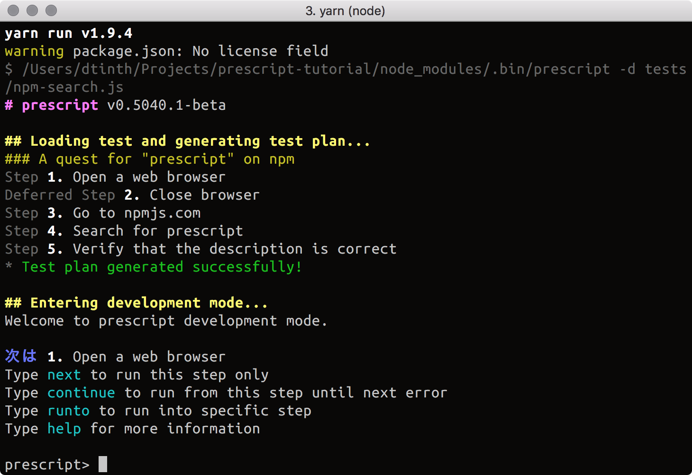
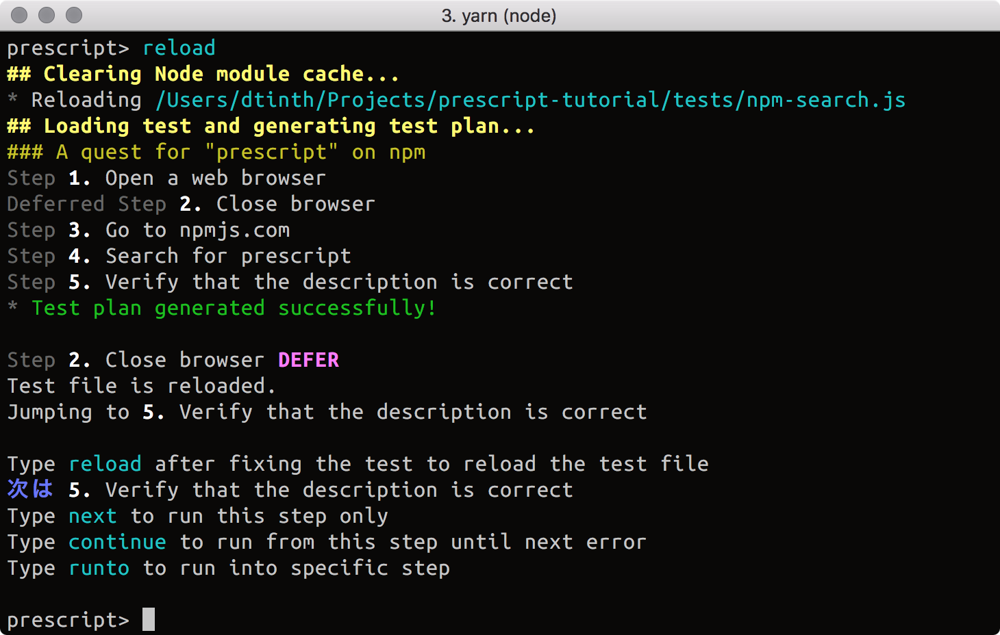
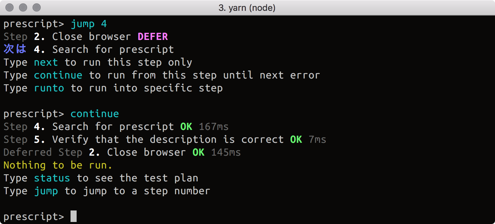

# A quick prescript primer (Tutorial)

Ready for a **prescript**ed experience? You’ll need:

* [Node.js](https://nodejs.org/en/)
* [Yarn](https://yarnpkg.com/en/) (make sure you have the latest version!)

I assume you know how to use Node.js and Yarn.

In this tutorial, we’re going to write a simple test using **prescript** and
[Puppeteer](https://github.com/googlechrome/puppeteer/). It will go to
`npmjs.com`, search for `prescript`, and verify that prescript is actually on
npm.

## Test project setup

* Let’s start by creating a new project:

  ```bash
  mkdir prescript-tutorial
  cd prescript-tutorial
  ```

* Install `prescript` and `puppeteer`:

  ```bash
  yarn add --dev prescript puppeteer
  ```

* Create a folder to store all our tests:

  ```bash
  mkdir tests
  ```

Now, our directory structure should look like this:

```
prescript-tutorial
├── tests/
├── package.json
└── yarn.lock
```

## Create the test file

* Create a file called `tests/npm-search.js` and paste in:

  ```js
  const puppeteer = require('puppeteer')
  const { test, action, defer } = require('prescript')
  const assert = require('assert')

  test('A quest for "prescript" on npm', () => {
    action('Open a web browser', async state => {
      state.browser = await puppeteer.launch({ headless: false })
      state.page = await state.browser.newPage()
    })
    defer('Close browser', async state => {
      state.browser.close()
    })
    action('Go to npmjs.com', async state => {
      await state.page.goto('https://npmjs.com')
    })
    action('Search for prescript', async state => {
      await state.page.type('[name="q"]', 'prescript')
    })
    action('Verify that the description is correct', async state => {
      const description = await getText(
        state.page,
        '[class^="package-list-item__description"]'
      )
      assert.equal(description, 'an end-to-end test runner that sparks joy')
    })
  })

  function getText(page, selector) {
    return page.evaluate(
      selector => document.querySelector(selector).textContent,
      selector
    )
  }
  ```

::: tip NOTE

You may notice there’s a variable called `state`. You must put everything that’s
shared between multiple steps in this variable.

You may ask, “why don’t we just use local variables instead, i.e. putting
`let browser` at the top of the file?” Well, you’ll see why soon… ;)

:::

## Run the test in interactive mode

Now we have the test, let’s run it!

* Run the test in **development mode** using `yarn prescript -d <test-file>`:

  ```bash
  yarn prescript -d tests/npm-search.js
  ```

This will drop you into a **prescript interactive shell:**



* Type in **`continue`** and press Enter.

This will run the test to its completion (or until it hits an error).

Let’s see how it goes…


Oops! There’s an error…

It’s time to debug!

## Debugging the test

Now, since we are in **interactive development mode**, the test is **paused**
here to let you inspect what’s going on. (In many other tools, the browser would
have closed immediately.)

Now we can take a look at the browser:


Hm… 🤔 what’s going on here???…………Oh! 😲 There it is! 💡

In the ‘Search for prescript’ step, **we typed the search text but didn’t press
Enter.** That’s why we stay at the same page...

<!-- prettier-ignore-start -->
```js {2}
  action('Search for prescript', async state => {
    await state.page.type('[name="q"]', 'prescript')
  })
```
<!-- prettier-ignore-end -->

## Fixing the test

Let’s go ahead and fix it…

<!-- prettier-ignore-start -->

* Update the test so that we press Enter key after typing in “prescript”:

  ```js {3}
    action('Search for prescript', async state => {
      await state.page.type('[name="q"]', 'prescript')
      await state.page.keyboard.press('Enter')
    })
  ```

* Don’t forget to save the file.

<!-- prettier-ignore-end -->

## Hot-reloading the test

Now we’re going to hot-reload our test file.

* Come back to **prescript interactive shell**.

* Type in **`reload`** (or `r`) and press Enter.

The test plan will be reloaded, but all your test state will remain intact.



::: tip NOTE

That’s the reason why we need the `state` variable — it’s preserved across
reloads! If we used a local variable, our new test code would not be able to
access the variables defined in the previous test code. That’s how hot-reloading
is made possible in prescript.

:::

## Fixing the test (again)

However, since the test failed on **step 5**, but the step that caused the
failure is actually **step 4**, we need to jump to **step 4** first, before
continuing on.

* Jump to step 4 by typing **`jump 4`** (or `j 4`) and press Enter.

* Continue running the test by typing **`continue`** (or `c`) and press Enter.


It failed again!

Let’s look at the browser to see what happened...


Since we **retried** step 4, it got run twice.

That means the word ‘prescript’ got typed into the search box twice!

::: tip LESSON

After reloading, make sure to revert the state continuing!

:::

Ok, let’s try again.

* In the browser, manually delete the text in the search box. Also click the
  Back button so that we are back to npm’s homepage.

* Come back to **prescript interactive shell**.

* Jump to step 4 by typing **`jump 4`** (or `j 4`) and press Enter.

* Continue running the test by typing **`continue`** (or `c`) and press Enter.


It failed again! But now it seems that the browser is showing the correct
result.

This is because after we press Enter, we didn’t wait for the search results to
load. So it went ahead to the next step immediately.

::: tip LESSON

Make sure each step verifies the outcome of its own action!

:::

<!-- prettier-ignore-start -->

* Update the test so that each step waits and checks for the outcome of its own
  actions (Don’t forget to save the file!):

  ```js {3,8}
    action('Go to npmjs.com', async state => {
      await state.page.goto('https://npmjs.com')
      await state.page.waitForSelector('#app main')
    })
    action('Search for prescript', async state => {
      await state.page.type('[name="q"]', 'prescript')
      await state.page.keyboard.press('Enter')
      await state.page.waitForSelector('[class^="search__packageList"]')
    })
  ```

* Come back to **prescript interactive shell**, **`jump 4`**, and **`continue`**.

<!-- prettier-ignore-end -->

Now, our test should pass ;)



* Exit prescript by typing **`exit`** and press Enter.

Now you understand how writing tests in prescript feels like.

## Running the test in non-interactive mode

In CI setting, you should run the test in non-interactive mode.

* Run the test in **non-interactive mode** using `yarn prescript <test-file>`:

  ```bash
  yarn prescript tests/npm-search.js
  ```

This will run the test to its completion, and exits with an error code if it
test failed. The prescript interactive shell is not available in this mode.


## Generating Allure reports

As introduced in the previous page, prescript can generate a beautiful test
report using Allure.

* Install the **Allure** command-line tool by following the
  [installation steps in its docs](https://docs.qameta.io/allure/#_installing_a_commandline).

* Set the environment variable `ALLURE_TEST_RESULTS` for the current shell:

  ```bash
  # Linux, macOS
  export ALLURE_RESULTS_DIR=allure-results

  # Windows
  SET ALLURE_RESULTS_DIR=allure-results
  ```

* Run the test in **non-interactive mode**:

  ```bash
  yarn prescript tests/npm-search.js
  ```

You should see a directory call **allure-results** created. Inside it you should
see XML files.

::: tip NOTE

If you use Git, don’t forget to add `allure-results` to your `.gitignore`.

:::

### View the test report

As you can see, **prescript** generates XML files to be used by Allure to
generate a test report.

* View the test report:

  ```bash
  allure serve allure-results
  ```


Nice.

### Generate the test report

The `allure serve` command lets you view the report in the browser. But you may
want to generate the test report and upload them for others to see.

* Generate the test report:

  ```bash
  allure generate test-results
  ```

A directory `allure-report` should pop up in your project directory.

::: tip NOTE

If you use Git, don’t forget to add `allure-report` to your `.gitignore`.

:::
