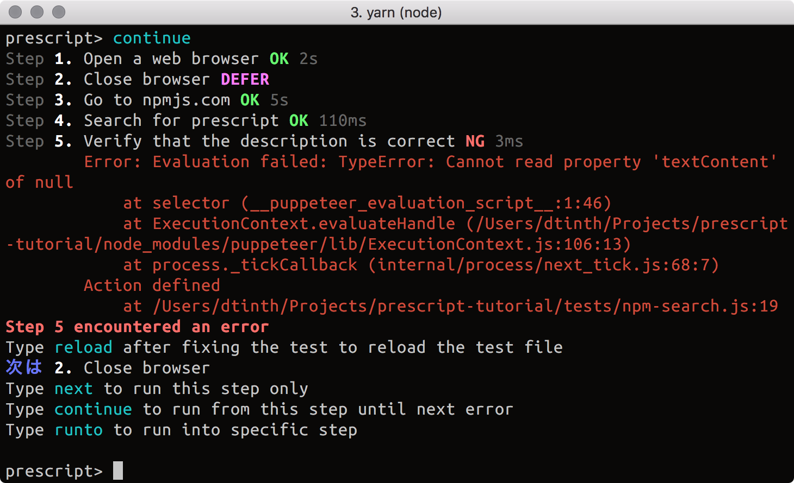
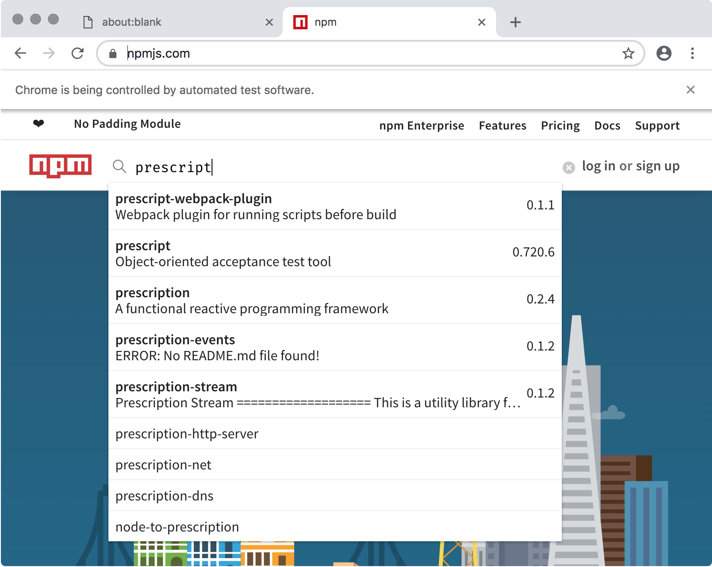

# A quick prescript primer (Tutorial)

Ready for a **prescript**ed experience? You’ll need:

* [Node.js](https://nodejs.org/en/)
* [Yarn](https://yarnpkg.com/en/) (make sure you have the latest version!)

I assume you know how to use Node.js and Yarn.

In this tutorial, we’re going to write a simple test using **prescript** and
[Puppeteer](https://github.com/googlechrome/puppeteer/). It will go to
`npmjs.com`, search for `prescript`, and verify that prescript is actually on
npm.

## Test project setup

Let’s start by creating a new project:

```sh
mkdir prescript-tutorial
cd prescript-tutorial
```

Install `prescript` and `puppeteer`:

```sh
yarn add --dev prescript puppeteer
```

Create a folder to store all our tests:

```sh
mkdir tests
```

Now, our directory structure should look like this:

```
prescript-tutorial
├── tests/
├── package.json
└── yarn.lock
```

## Create the test file

Create a file called `tests/npm-search.js` and paste in:

```js
const puppeteer = require('puppeteer')
const { test, action, defer } = require('prescript')
const assert = require('assert')

test('A quest for "prescript" on npm', () => {
  action('Open a web browser', async state => {
    state.browser = await puppeteer.launch({ headless: false })
    state.page = await state.browser.newPage()
  })
  defer('Close browser', async state => {
    state.browser.close()
  })
  action('Go to npmjs.com', async state => {
    await state.page.goto('https://npmjs.com')
  })
  action('Search for prescript', async state => {
    await state.page.type('[name="q"]', 'prescript')
  })
  action('Verify that the description is correct', async state => {
    const description = await getText(
      state.page,
      '[class^="package-list-item__description"]'
    )
    assert.equal(description, 'an end-to-end test runner that sparks joy')
  })
})

function getText(page, selector) {
  return page.evaluate(
    selector => document.querySelector(selector).textContent,
    selector
  )
}
```

::: tip NOTE

You may notice the presence of the variable `state`. You must put everything
that’s shared between steps in this variable.

You may ask, “why don’t we just use local variables instead, i.e. using
`let browser` at the top of the file?” You’ll see why soon… ;)

:::

## Run the test in interactive mode

Now we have the test, let’s run it:

```sh
yarn prescript -d tests/npm-search.js
```

This will drop you into a **prescript interactive shell:**


Type in `continue` and press Enter. This will run the test to its completion (or
until it hits an error).

Oops! There’s an error…



## Debugging the test

The test is **paused** here to let you inspect what’s going on. (In many other
tools, the browser would have closed immediately.)

Now we can take a look at the browser:



Looking back at the test, we see here that in the ‘Search for prescript’ step,
**we typed the search text but didn’t press Enter.** That’s why we stay at the
same page...

<!-- prettier-ignore-start -->
```js {2}
  action('Search for prescript', async state => {
    await state.page.type('[name="q"]', 'prescript')
  })
```
<!-- prettier-ignore-end -->

Let’s go ahead and fix it:

<!-- prettier-ignore-start -->
```js {3}
  action('Search for prescript', async state => {
    await state.page.type('[name="q"]', 'prescript')
    await state.page.press('Enter')
  })
```
<!-- prettier-ignore-end -->

Coming back to **prescript interactive shell**, type in `reload` and press
Enter. The test plan will be reloaded, but all your test state will remain
intact.

::: tip NOTE

That’s the reason why we need the `state` variable — it stays across reloads!

:::
